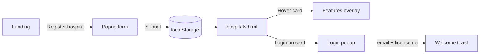

# MediCRM

<p align="center">
  
  
  
</p>

<p align="center">
  <strong>Hospital ↔ Patient intermediator</strong><br/>
  Hospitals register → appear as cards → log in from their own card.
</p>

> **Handoff doc.** Give this file to another AI (or teammate) so they keep the same colours, fonts, field names, and flows.

---

## Contents

1. [What this is](#what-this-is)
2. [Run locally](#run-locally)
3. [File structure](#file-structure)
4. [App flow](#app-flow)
5. [Pages](#pages)
6. [Register form](#register-form)
7. [Data model](#data-model)
8. [Colour palette](#colour-palette)
9. [Fonts & type](#fonts--type)
10. [UI kit](#ui-kit)
11. [Rules for the next AI](#rules-for-the-next-ai)
12. [Not built yet](#not-built-yet)
13. [Test checklist](#test-checklist)

---

## What this is

| | |
|---|---|
| **Brand** | MediCRM |
| **Job** | CRM + matching layer between hospitals and patients |
| **Stack** | Vanilla HTML, CSS, JS · no npm · no framework |
| **Data** | Browser `localStorage` only |
| **Copy** | English UI + Hinglish on the landing page |

Patients can *read* about booking. They cannot book yet. Hospitals can register, show on the network, and demo-login.

---

## Run locally

```bash
cd HospitalFrontend
python -m http.server 5500
```

| Page | URL |
|------|-----|
| Landing | http://127.0.0.1:5500/ |
| Hospital show | http://127.0.0.1:5500/hospitals.html |

> Prefer **5500**. Port **8080** is often already taken on this machine.

---

## File structure

```text
HospitalFrontend/
│
├── index.html                 Landing + register popup
├── hospitals.html             Show page + login + register popup
├── README.md                  This guide
│
├── css/
│   └── style.css              All styles (one file)
│
└── js/
    ├── storage.js             localStorage  ← load first
    ├── main.js                Nav, register modal, toast
    └── hospitals-page.js      Cards, hover, login
```

**Script order — do not shuffle**

| Page | Load order |
|------|------------|
| `index.html` | `storage.js` → `main.js` |
| `hospitals.html` | `storage.js` → `main.js` → `hospitals-page.js` |

`hospitals-page.js` needs `getHospitals` / `addHospital` from storage, and `openRegister` / `openToast` from main.

---

## App flow



### Register

1. Click any **Register hospital** (`[data-open-register]`).
2. `#registerModal` opens (page scroll locked).
3. Submit `#hospitalForm` → `addHospital()`.
4. Redirect to `hospitals.html?registered=1`.
5. New hospital is **first** in the grid.

Close with `×` (`[data-close-register]`) or click the dark overlay.

### Show page + hover

- Card shows photo, name, city, email · phone.
- **Login stays at the bottom** of the card (always visible).
- **Hover** the card → `.card-hover` fades in (features + address + license).
- Image zooms to `1.08`.

### Login

| Item | Value |
|------|--------|
| Trigger | **Login** on that card (`data-login-id`) |
| Email | Prefills from the hospital |
| Password | **License no** (no extra password field) |
| Success | Toast: `Welcome, {hospitalName}` |
| Fail | Toast: email / license mismatch |
| Dashboard | **Not built** — toast only |

Nav **Hospital login**: first hospital’s login, or register popup if the list is empty.

---

## Pages

### Landing · `index.html`

| Anchor | What you see |
|--------|----------------|
| `#home` | Hero photo, CTAs, live-network glass card |
| `#how` | 3 steps: register → discover → match |
| `#features` | 8 product cards |
| `#hospitals` | Split: for hospitals |
| `#patients` | Split: for patients |
| `#register` | CTA only (opens popup, not an inline form) |
| `#registerModal` | Registration popup |
| `#toast` | Success / info |

**Nav:** How it works · Features · For hospitals · For patients · Hospital network → `hospitals.html`

**Sign in** (`[data-open-login]`) → `hospitals.html#login`

### Show page · `hospitals.html`

- Grid `#hospitalGrid` of `.hospital-card`
- Same register popup as landing
- `#loginModal` for hospital login
- `?registered=1` → “Hospital registered” toast
- Empty list → dashed empty state + register button

---

## Register form

Keep `name` attributes in **both** HTML files.

| Label | `name` | Rules |
|-------|--------|--------|
| Hospital name | `hospitalName` | required |
| Email | `email` | required, email |
| Phone no | `phoneNo` | required |
| Address | `address` | required |
| City | `city` | required |
| State | `state` | required |
| Pincode | `pincode` | required, 6 digits `[0-9]{6}` |
| License no | `licenseNo` | required · **also used as login password** |
| GST no | `gstNo` | required |

There is no separate password field on purpose.

---

## Data model

| | |
|---|---|
| **Key** | `medicrm-hospitals` |
| **Shape** | JSON array, newest first |

```js
{
  id,          // uuid or Date.now()
  createdAt,   // ISO string
  image,       // Unsplash URL, rotated from HOSPITAL_IMAGES
  features,    // DEFAULT_FEATURES unless you override
  hospitalName, email, phoneNo, address,
  city, state, pincode, licenseNo, gstNo
}
```

**Helpers:** `getHospitals` · `saveHospitals` · `addHospital` · `findHospitalByEmail`  
File: `js/storage.js`

A future API should keep these field names.

**Default features on hover**

- OPD appointment booking
- IPD & live bed map
- Patient records & labs
- Billing, GST & insurance
- Doctor roster & slots
- Secure hospital–patient chat

---

## Colour palette

Theme: **calm hospital CRM** — teal on mint paper, navy type, photo overlays. Not a dark dashboard.

<p align="center">
  
  
  
  
</p>

### Tokens in `:root` (`css/style.css`)

| Swatch | Token | Hex | Use |
|:------:|-------|-----|-----|
|  | `--teal` | `#0f766e` | Brand, eyebrows, links hover |
|  | `--teal-deep` | `#115e59` | Darker teal |
|  | `--mint` | `#99f6e4` | Hero labels, live-card meta |
|  | `--navy` | `#0b1f2a` | Footer, stats, secondary btn |
|  | `--ink` | `#102a37` | Body text |
|  | `--paper` | `#f4fbf9` | Page background |
|  | `--white` | `#ffffff` | Cards, popups |
|  | `--sand` | `#f7efe6` | Warm accent (barely used) |
|  | `--coral` | `#e11d48` | Errors only — **not** CTA |
|  | `--gold` | `#f59e0b` | Defined, unused |
|  | `--muted` | `#5b7180` | Secondary copy, nav |
| | `--line` | `rgba(15, 118, 110, 0.14)` | Borders |
| | `--shadow` | `0 24px 60px rgba(11, 31, 42, 0.18)` | Cards / popups |
| | `--radius` | `22px` | Large cards |

### Extra colours (hardcoded)

| Colour | Where |
|--------|--------|
| `#14b8a6` → `#0f766e` | Primary **button gradient** |
| `#22c55e` | Live green dot |
| `#ccfbf1` | Checklist bullet |
| `#e8f7f4` | Tinted sections |
| `#eef7f5` | Modal close button |
| `#f8fdfc` | Input fill |
| `#d7e6e2` | Input border |
| `rgba(11, 31, 42, 0.88)` | Hero overlay |
| `rgba(11, 31, 42, 0.55)` | Modal dim |
| navy `0.2` → `0.92` | Card hover overlay |

> **CTA is always teal.** Do not make primary buttons coral or gold.

---

## Fonts & type

Loaded on **both** pages from Google Fonts:

```
Outfit              400–800     headings, brand, eyebrows
Plus Jakarta Sans   400–800     body, buttons, labels, inputs
Fallback            system-ui, sans-serif
```

```
https://fonts.googleapis.com/css2?family=Outfit:wght@400;500;600;700;800&family=Plus+Jakarta+Sans:wght@400;500;600;700;800&display=swap
```

| Role | Font | Notes |
|------|------|--------|
| `h1–h3`, `.brand`, `.eyebrow` | Outfit | Tracking `-0.03em` to `-0.04em` |
| Everything else | Plus Jakarta Sans | `line-height: 1.6` |
| `.eyebrow` | Outfit | Uppercase, `0.16em` letter-spacing, ~0.78rem, teal (mint on dark hero) |

---

## UI kit

| Class | Look |
|-------|------|
| `.btn.primary` | Teal gradient pill |
| `.btn.secondary` | Navy pill |
| `.btn.ghost` | Transparent (Sign in) |
| `.btn.glass` | Frosted white (on hero photo) |
| `.btn.lg` / `.btn.full` | Bigger / full width |
| `.brand` + `.brand-mark` | “+” in a teal rounded square |
| `.container` | `min(1120px, 100% − 40px)` |
| `.modal` | Full overlay · `[hidden]` = hidden |
| `.popup-card` | Register shell, max 720px, scrolls at 90vh |
| `.popup-card.slim` | Login shell, max 440px |
| `.toast-card` | Centre message |
| `.hospital-card` | Network card |
| `.card-hover` | Features overlay (opacity 0 until hover) |
| `.empty-card` | Dashed empty state |

**Buttons:** `border-radius: 999px`, weight **700**.

**Breakpoints**

| Width | Behaviour |
|-------|-----------|
| `≤ 960px` | Grids stack, hamburger menu, Sign in hidden, **Register stays** |
| `≤ 640px` | Tighter hero, single-column form rows |

**Motion:** `.reveal` fade-up · `[data-count]` stats · smooth scroll · `scroll-margin-top: 84px` for sticky nav.

**Photos:** Unsplash URLs in HTML + `HOSPITAL_IMAGES`. Need internet. Card image = `list.length % 4`. If a URL 404s, swap the URL only; keep `object-fit: cover`.

---

## Rules for the next AI

1. Stay on **vanilla HTML / CSS / JS** unless asked otherwise.
2. One CSS file until it really needs splitting.
3. Do not rename `[data-open-register]`, form `name`s, or `medicrm-hospitals`.
4. Register popup is duplicated on **two HTML files** — edit both, or extract later.
5. Login is **per card**, not a global staff portal.
6. Keep `escapeHtml()` when rendering cards.
7. Use the existing modal / toast — not `alert()`.
8. Landing copy may stay Hinglish; form labels stay English.
9. No `.env`. Demo login is local only.
10. Sensible next work: real dashboard after login, session, backend API, patient booking.

---

## Not built yet

- Patient signup / booking
- Real auth, sessions, hashed passwords
- License / GST verification
- Roles UI (copy only)
- Backend, database, bundler

---

## Test checklist

- [ ] Landing: hero photo + teal CTAs
- [ ] Popup: all **9** fields
- [ ] Submit → `hospitals.html?registered=1` + new card
- [ ] Hover card → features
- [ ] **Login** always at card bottom
- [ ] Login with email + license works; wrong license fails
- [ ] Empty storage → empty state
- [ ] Mobile: hamburger; Register still in header

---

<p align="center">
  <sub>MediCRM · teal <code>#0f766e</code> · navy <code>#0b1f2a</code> · paper <code>#f4fbf9</code></sub>
</p>
